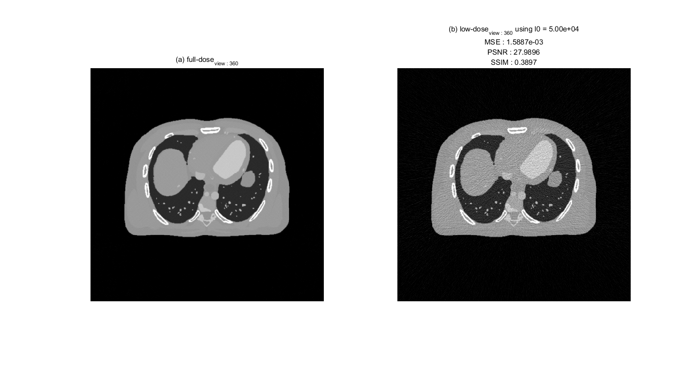

# CG method

## Reference 
Conjugate Gradient Method `(ENG)`
- https://en.wikipedia.org/wiki/Conjugate_gradient_method

켤레기울기법 `(KOR)`
- https://ko.wikipedia.org/wiki/%EC%BC%A4%EB%A0%88%EA%B8%B0%EC%9A%B8%EA%B8%B0%EB%B2%95

## Conjugate Gradient Method (CG)
The conjugate gradient method is an algorithm for the numerical solution of particular systems of linear equations, namely those whose matrix is [symmetric](https://en.wikipedia.org/wiki/Symmetric_matrix) and [positive-definite](https://en.wikipedia.org/wiki/Positive-definite_matrix). The conjugate gradient method is often implemented as an [iterative algorithm](https://en.wikipedia.org/wiki/Iterative_method), applicable to sparse systems that are too large to be handled by a direct implementation or other direct methods such as the Cholesky decomposition. 

## Description of the problem
Suppose we want to solve the [system of linear equations](https://en.wikipedia.org/wiki/System_of_linear_equations)

        (P1) A * x   = b    : matrix ver.
        
or,

        (P2) A( x )  = b    : function ver. 
        
for the vector `x`, where the known n x n matrix `A` is symmetric (i.e., A^T = A), positive-definite (i.e., x^T A x > 0 for all non-zero vectors x in R^n), and real, and `b` is known as well. We denote the unique solution of this system by `x^*`.

## The basic iteration CG for solving problem (matrix ver.)
```matlab
function [x] = conjgrad(A, b, x)
    r = b - A * x;
    p = r;
    rsold = r' * r;

    for i = 1:length(b)
        Ap = A * p;
        alpha = rsold / (p' * Ap);
        x = x + alpha * p;
        r = r - alpha * Ap;
        rsnew = r' * r;
        if sqrt(rsnew) < 1e-10
            break;
        end
        p = r + (rsnew / rsold) * p;
        rsold = rsnew;
    end
end
```

## The basic iteration CG for solving problem (function ver.)

```matlab
function [x] = conjgrad(A, b, x, N)
    r = b - A ( x );
    p = r;
    rsold = r(:)' * r(:);

    for i = 1:N
        Ap = A ( p );
        alpha = rsold / (p(:)' * Ap(:));
        x = x + alpha * p;
        r = r - alpha * Ap;
        rsnew = r(:)' * r(:);
        if sqrt(rsnew) < 1e-10
            break;
        end
        p = r + (rsnew / rsold) * p;
        rsold = rsnew;
    end
end
```


---

## Example 
### Problem definition
In X-ray computed tomography (CT) system, radiation exposure is critical limitation. To reduce the radiation exposure, X-ray CT system uses a low-dose X-ray source. The low-dose X-ray source generate severe poison noise when X-ray photon are measured at X-ray detector, then a reconstruction image using low-dose measurement is too noisy to diagnosis diseases by doctor. Below image shows (a) full-dose image and (b) low-dose image, respectively.



To reduce the noise, objective function with total variation (TV) regularization can be formulated as follows:

$$L(\textrm{x}) = \frac{1}{2} || \textrm{y} - A\textrm{x} ||_2^2 + \frac{\lambda}{2} ( ||D_x(\textrm{x})||_2^2 + ||D_y(\textrm{x})||_2^2 ),$$

where $\textrm{y}$ is measurement and $\textrm{x}$ defines reconstruction image (denoised image). $A$ is system operator (in this case, it is defined as CT system operator, called by **radon transform**). $D_x$ and $D_y$ are differential operators along x-axis and y-axis, respectively.

In above equation, since each terms is quadratic function, an optimal point of $\textrm{x}$ is $\frac{d}{d\textrm{x}}L(x)=0$:

$$-A^T (\textrm{y} - A\textrm{x})+ \lambda( D_x^T D_x(\textrm{x}) + D_y^T D_y(\textrm{x})) = 0,$$

$$A^TA(\textrm{x}) + \lambda( D_x^T D_x(\textrm{x}) + D_y^T D_y(\textrm{x})) = A^T\textrm{y},$$

$$[A^TA + \lambda( D_x^T D_x + D_y^T D_y)](\textrm{x}) = A^T\textrm{y}.$$

To match the CG formula, $[A^TA + \lambda( D_x^T D_x + D_y^T D_y)]$ is defined as $A_{cg}$ and $A^T\textrm{y} = b$, then

$$\therefore A_{cg}(\textrm{x}) = b.$$

Now, above equation form $A_{cg}(\textrm{x}) = b$ is exactly matched with CG equation form $A(x)=b$. Using above reordered formula, optimal point $\textrm{x}^*$ of $L(\textrm{x})$ can be found.

### Results

